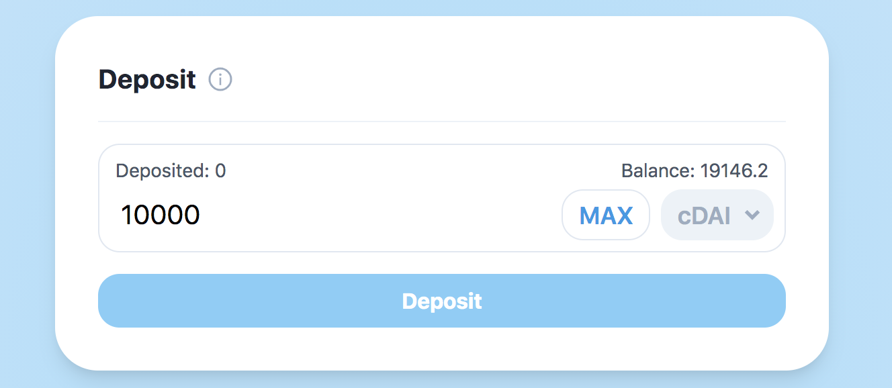
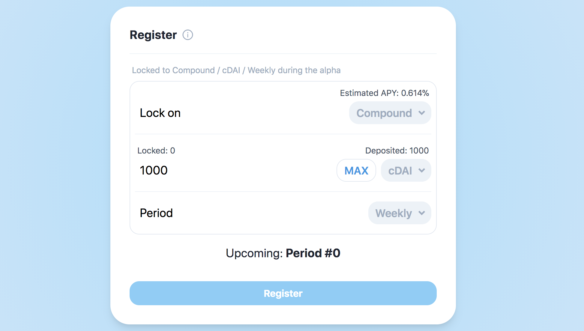

The Alpha version of **APWine** is now deployed and open to the public on the **Rinkeby** test network, on [APWine Alpha](https://alpha.apwine.fi/).

**APWine Alpha**, or codename *Muscat*, will let you try the platform with **cDAI** for fixed periods of **1 week**.

We've designed the interface to make it as simple as possible to use and understand, but for newcomers we've written a step-by-step tutorial you can find below.

# Tutorial

First of all, make sure you are on the **Rinkeby** test network. This can usually be set from the settings menu of your wallet.

## 1. Getting some ETH and cDAI

You will need **ETH** to fuel interactions on the platform. There are several faucets online, including [Rinkeby Faucet](https://faucet.rinkeby.io/) and [MetaMask Faucet](https://faucet.metamask.io/). If these don't work, please reach out to a team member and we'll help you get on track.

**cDAI** can be obtained directly on the [Compound App](https://app.compound.finance/). Once connected to your wallet, head to your dashboard and, in the **Supply** section, click on **Dai**. A window should appear with a **Faucet** button at the bottom. Click on it and send the transaction. Once accepted, you will have some **Dai** in your wallet. Free (test) money!

Next, from your dashboard, click again on **Dai** and, this time, enter an amount of **Dai** you want to supply. You can click on **MAX** to supply all of your **Dai** automatically. Then click on **Supply** and send the transaction. Your funds are now locked on Compound and you get some **cDAI** in return.

You're now (test) **cDAI** rich, and ready to use **APWine**!

## 2. Depositing on APWine

Head over to [APWine Alpha](https://alpha.apwine.fi/) and connect your wallet.

You should land on the **Overview** homepage. From the side navigation bar, go to **Deposit**.

**cDAI** should automatically be selected. Enter an amount or click the **MAX** button, then **Approve** the spend when prompted. After the transaction has been processed, you should now be able to **Deposit** your **cDAI**.

You can confirm your **cDAI** was deposited on the platform by checking the *Deposited* label on the left or by checking your **Dashboard**. 

## 3. Registering to a period

Navigate to the **Register** page. If the next period is available to register, you should see an "*Upcoming Period*" message with the start and duration of the period.

To register for this period, simply enter an amount of **cDAI** you want to provide and click **Register**. This amount of **cDAI** will be locked till the end of the period, and then released back to your **APWine** deposited balance.

After the transaction is complete, you can check that your **cDAI** was correctly registered with either the *Locked* label of directly through your **Dashboard**.

At the start date of the period, you will automatically be sent your tokenized yield in the form of **WXCDAI** tokens, where *X* is the period index, starting from 0.

*Note: The start of the period may* **not** *be exactly the time indicated, since it has to be started manually for now. Nonetheless, directly after the given period date, you will* **not** *be able to register any longer.*

## 4. Trading your WXCDAI

Your funds are locked, the period has started, and you now have a corresponding tokenized yield in your wallet. Great! Let's start trading.

Head over to the **Trade** page from the navigation bar.

The corresponding settings should already be selected for you. If the interests are ready to trade, a button to **Uniswap** should be visible. Click on it to access the Uniswap listing and trade it.

## 5. Claiming your yield

The period has now ended and your initial funds have been unlocked back into your deposited balance. But you still have your tokenized yield, that you either sold, hodled or traded for more!

To claim your interests, go to the **Claim** page. The corresponding settings will be selected automatically.

If the period has ended and the interests are available to claim, you should see the **Claim** button at the bottom.

*Note: You can selected your desired period by clicking on the* **Previous** *and* **Next** *buttons on the side. No worries, your yield will always be available to claim, even when the next period starts!*

# Getting help

If you're having trouble with any of the steps mentioned in the tutorial, please reach out to a member of our team, either on [Telegram](https://t.me/APWineFinance) or by e-mail at [contact@apwine.fi](mailto:contact@apwine.fi).

&nbsp;

&nbsp;

Thank you for reading. We hope you enjoy using this first version of **APWine** and that you are as excited as we are about the future of the project.

As always, please feel free to leave any feedback, suggestions, or questions in our [Telegram](https://t.me/APWineFinance) group. We'll be happy to answer!