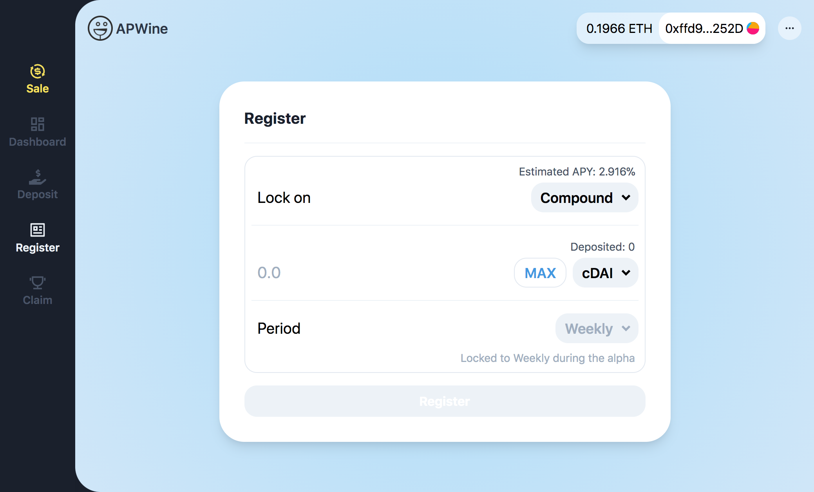

The Alpha version of the APWine client is on the way to deployment on the Testnet, and will be announced soon.

In the meantime, we would like to give the community an overview of the interface and user experience.

Presenting **APWine Alpha**.

# User Experience

The Alpha is designed to be simple and intuitive for newcomers, as well as more experienced DeFi users.

## Deposit

After connecting your wallet with MetaMask, you will have the option of depositing an initial amount of tokens on the platform. Only **cDAI** will be available to deposit during the Alpha.

## Register

This is the main part of the app where you will be able to 

&nbsp;

&nbsp;

As always, you are welcome to leave any feedback or suggestions in our [Telegram](https://t.me/APWineFinance) group.